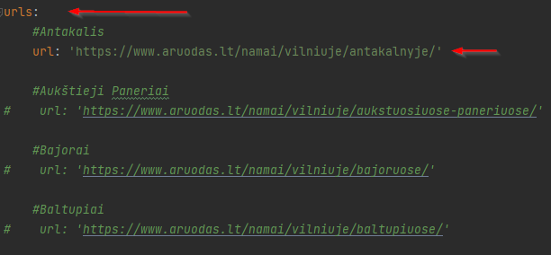

##Introduction
Project's purpose is to scrape www.aruodas.lt for houses in Vilnius and print info to console

##Installation

- Clone repository using code in CLI `git clone https://github.com/AleksasBarzdaitis/PP1`
- Install requirements using code in CLI `pip install -r requirements.txt`

##Usage

- Choose microdistrict and uncomment url next to it in **config.yml** file in urls section (by default Antakalnis is selected)

- Important: application will not run if no url or more than one is selected (uncommented)
- Run **main.py** file

